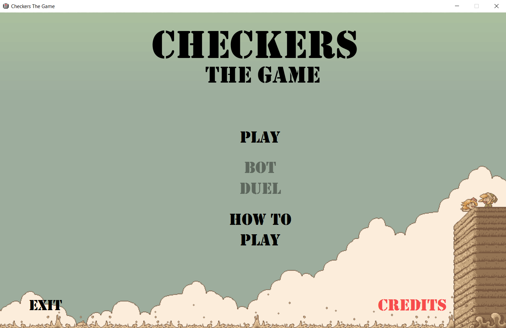
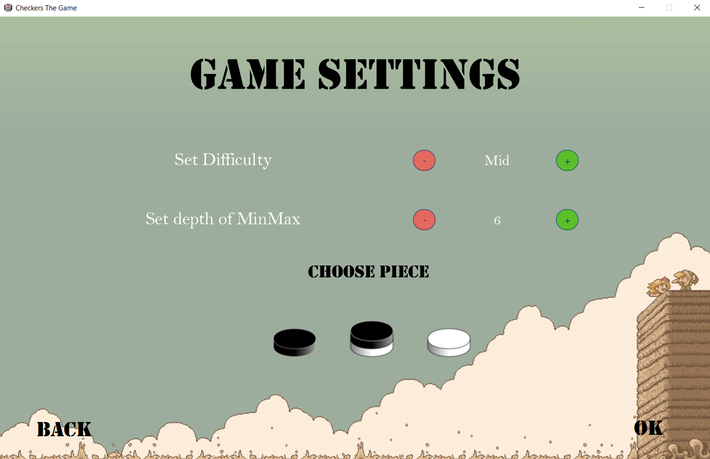
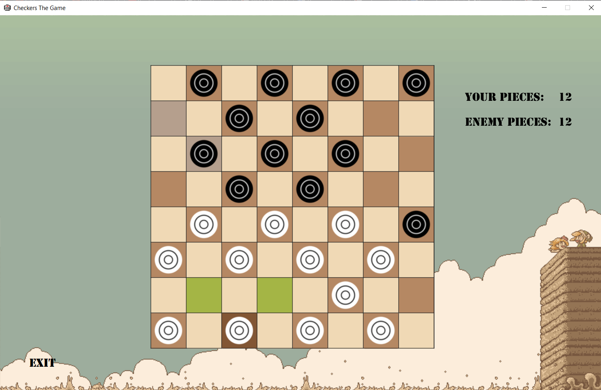

# PROJECT 3


# Checkers


## How to play
**What you need**:
- Java IDE for example Intellij IDEA
- javaFX 18 SDK

**What to do**:
- set up your IDE, so it can run main.java :

File -> Project Structure -> Libraries -> add path to javaFX lib directory
- set up your run/debug configuration 

Run -> Edit Configurations -> Click '+'  -> Add Application -> Modify options -> Add VM options
  and paste this to VM options: 

```--module-path /path/to/SDK/lib --add-modules javafx.controls,javafx.fxml```

## Informational details of the task
- Deadline for the commissioning of the task : 13/06/2022
- A task that will be implemented  - task for assessment: 5.0 - checkers with GUI
- Final assessment of the task  - [5.15 / 5]

[PDF with report of the task ](https://gitlab.com/JasinskiR259384/pamsi-2022/-/blob/main/PROJECT_3/Report_PAMSI_3.pdf)

[PDF with a list of tasks ](https://gitlab.com/JasinskiR259384/pamsi-2022/-/blob/main/PROJECT_3/proj3.pdf)

### Preview of the game
<details><summary>Click to see images</summary>




</details>
